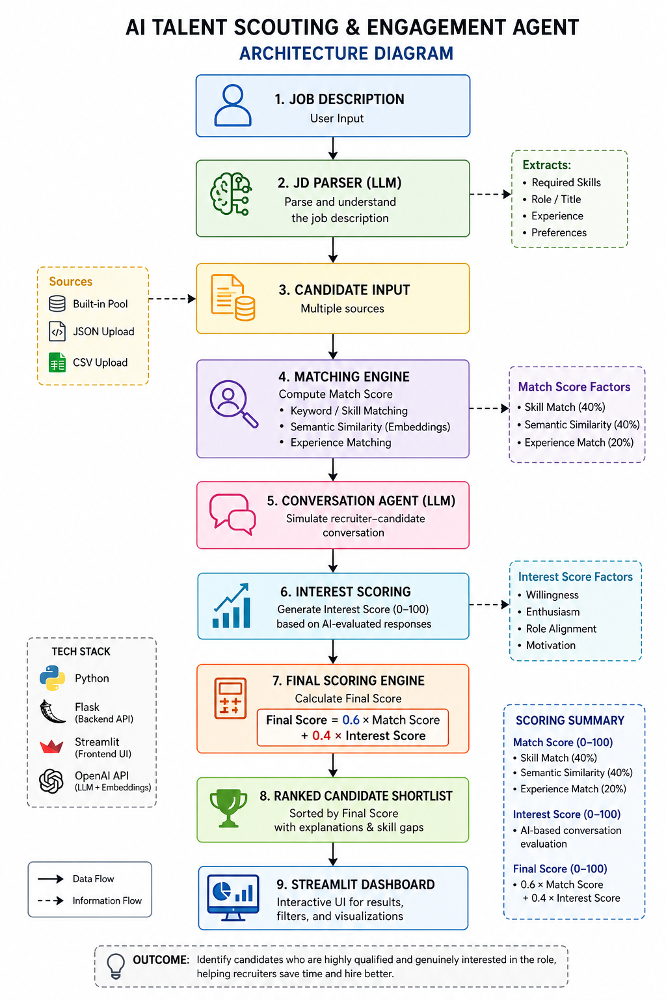

# AI Talent Scouting & Engagement Agent

## 🚀 Working Prototype

This is an AI-powered recruitment assistant that:
- Parses Job Descriptions
- Matches candidates
- Simulates candidate interest
- Generates Match Score and Interest Score
- Produces a ranked shortlist

---

## 🖥️ How to Run the Project

### 1. Clone the repository
git clone https://github.com/YOUR_USERNAME/ai-talent-agent.git
cd ai-talent-agent

### 2. Create virtual environment (Windows)
python -m venv venv
venv\Scripts\activate

### 3. Install dependencies
pip install -r requirements.txt

### 4. Set API Key
setx OPENAI_API_KEY "your_api_key"

Restart terminal after this step.

### 5. Run backend
python app.py

### 6. Run frontend
streamlit run ui.py

### 7. Open in browser
http://localhost:8501

---

## ⚙️ Features

- Job Description parsing
- Candidate matching (Match Score)
- Interest prediction (Interest Score)
- Final ranking
- Skill gap analysis
- Explainable results

---

## 🏗️ Architecture Diagram

---

## 🧠 System Architecture

The system follows a modular pipeline:

1. Job Description is provided by the user  
2. JD Parser (LLM) extracts skills, role, and experience  
3. Candidates are sourced (built-in / JSON / CSV / AI-generated)  
4. Matching Engine computes Match Score using:
   - Skill overlap (keyword matching)
   - Semantic similarity (embeddings)
   - Experience matching  
5. Conversation Agent simulates candidate response  
6. Interest Score is generated using AI  
7. Final Score is calculated using weighted combination  
8. Candidates are ranked and displayed in the UI  

---

## 📊 Scoring Logic

**Match Score (0–100):**
- Skill Match → 40%  
- Semantic Similarity → 40%  
- Experience Match → 20%  

**Interest Score (0–100):**
- Generated using AI conversation  
- Evaluates willingness, enthusiasm, and role alignment  

**Final Score:**
Final Score = 0.6 × Match Score + 0.4 × Interest Score

---

## 🎯 Outcome

The system helps recruiters identify candidates who are both:
- Technically qualified  
- Genuinely interested  

This reduces manual effort and improves hiring efficiency.

---

## 🧪 Sample Input

**Job Description:**
Looking for Python Backend Developer with Flask and 2+ years experience
**Candidates:**
[
  {
    "name": "Rahul Sharma",
    "skills": ["Python", "Flask", "SQL"],
    "experience": 2,
    "location": "Hyderabad",
    "summary": "Backend developer"
  }
]

---

## 📊 Sample Output

- Match Score: 70+
- Interest Score: 65+
- Final Score: Ranked output
- Explanation of selected candidate
- Skill gap analysis